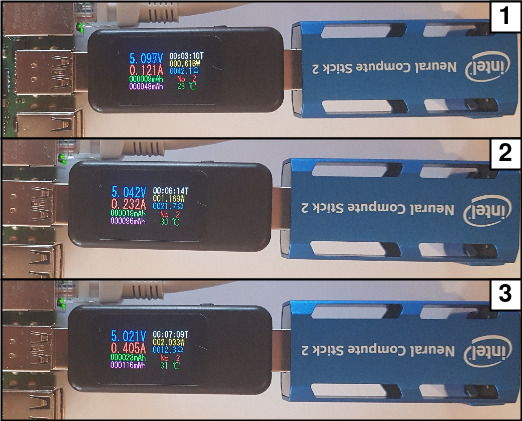
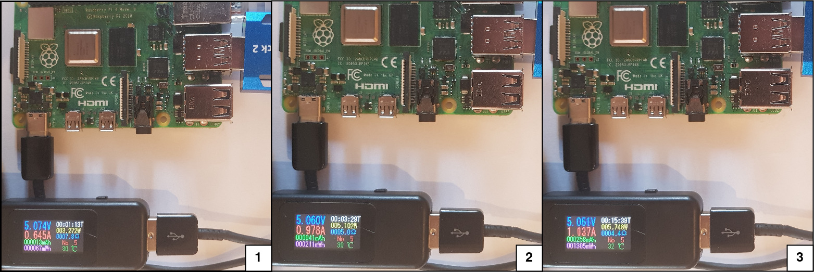

# DeepSort YOLOv4 based object tracking

The repository contains the implementation of [DeepSort](https://arxiv.org/abs/1703.07402) object tracking based on YOLOv4 detections. Detector inference class is implemented in several frameworks like TensorFlow, TensorFlow Lite, TensorRT, OpenCV, and OpenVINO to benchmark methods and use the best one for edge-tailored solutions.

<p align="center"></p>

## How to use

```bash
python3 object_tracker.py -f trt -m <PATH TO MODEL> -s <MODEL INPUT SIZE> -n <PATH TO FILE WITH CLASS NAMES> -v <PATH TO INPUT VIDEO> --dont_show True
```

**NOTE**

If one wants to run inference one NVIDIA devices with TensoRT support needs to uncomment [`TrtYOLO`](detectors/yolo_trt.py) detector import in [`detectors/__init__.py`](detectors/__init__.py). The same issue is for utilizing [`OpenvinoYOLO`](detectors/yolo_openvino.py) class on Intel hardware.

### Command line arguments

```bash
Usage: object_tracker.py [OPTIONS]

Options:
  -f, --framework TEXT      Inference framework: {tf, tflite, trt, opencv,
                            openvino}
  -m, --model_path TEXT     Path to detection model
  -n, --yolo_names TEXT     Path to YOLO class names file
  -s, --size INTEGER        Model input size
  -t, --tiny BOOLEAN        If YOLO tiny architecture
  -t, --model_type TEXT     yolov3 or yolov4
  -v, --video_path TEXT     Path to input video
  -o, --output TEXT         Path to output, inferenced video
  --output_format TEXT      Codec used in VideoWriter when saving video to
                            file
  --iou FLOAT               IoU threshold
  --score_threshold FLOAT   Confidence score threshold
  --opencv_dnn_target TEXT  Precision of OpenCV DNN model
  --device TEXT             OpenVINO inference device, available: {MYRIAD,
                            CPU, GPU}
  --dont_show BOOLEAN       Do not show video output
  --info BOOLEAN            Show detailed info of tracked objects
  --count BOOLEAN           Count objects being tracked on screen
  --help                    Show this message and exit.
```

## Preparation of the algorithm

[YOLOv4](https://arxiv.org/abs/2004.10934) object detector was trained with the use of [Darknet](https://github.com/AlexeyAB/darknet) framework and on the [VisDrone datasets](http://aiskyeye.com/). Images were captured from UAV's perspective. Each independent object belongs to one of the 11 categories. Small and occluded parts of images where were many instances were marked as an ignored region (12 category). The YOLOv4 configuration file is in [data/darknet/yolov4_visdrone.cfg](data/darknet/yolov4_visdrone.cfg), classes file is in [data/classes/visdrone.names](data/classes/visdrone.names) and calculated sizes of anchor boxes are in [data/anchors/visdrone_anchors.txt](data/anchors/visdrone_anchors.txt).

The optimization and quantization process was performed with use of [TensorRT](https://developer.nvidia.com/tensorrt) for [NVIDIA Jetson Xavier NX](https://developer.nvidia.com/embedded/jetson-xavier-nx) and [OpenVINO](https://docs.openvinotoolkit.org/latest/index.html) for [Intel Neural Compute Stick 2](https://software.intel.com/content/www/us/en/develop/hardware/neural-compute-stick.html). 

Conversion steps are described in following files:
- [**TensorRT**](tensorrt/README.md)
- [**OpenVINO**](openvino/README.md)
- [**TensorFlow Lite**](tflite/README.md)

## Performance tests

The benchmark tests were performed on [NVIDIA Jetson Xavier NX](https://developer.nvidia.com/embedded/jetson-xavier-nx) and [Intel Neural Compute Stick 2](https://software.intel.com/content/www/us/en/develop/hardware/neural-compute-stick.html). Jetson Xavier NX was in mode 2 (`sudo nvpmodel -m 0`) and clocks, fan were set to the maximum frequency with `sudo jetson clocks --fan` command. To evaluate Intel INCS 2 Raspberry Pi 4B was used. The evaluation results are listed below.

The full TensorFlow library was utilized for Raspberry Pi 4B. The build instruction for TensorFlow 2.2.0 is available [here](https://qengineering.eu/install-tensorflow-2.2.0-on-raspberry-pi-4.html).

**NVIDIA Jetson Xavier NX**

|   YOLOv4-608 model   | average time per frame [s] | average detection time [s] | average  tracker time [s] |
|:--------------------:|:--------------------------:|:--------------------------:|:-------------------------:|
|    TensorFlow FP32   |           1.5475           |           0.3365           |           0.7518          |
|     TensorRT FP32    |           1.1977           |           0.1787           |           0.6487          |
|     TensorRT FP16    |           1.0545           |           0.0516           |           0.6583          |
|     TensorRT INT8    |           0.6241           |           0.0301           |           0.3622          |
| TensorFlow Lite FP32 |           22.7165          |           21.4231          |           0.8031          |
| TensorFlow Lite FP16 |           17.1216          |           15.9608          |           0.7268          |

**Intel Neural Compute Stick 2 with Raspberry Pi 4B**

|  YOLOv4-608 model  | average time per frame [s] | average detection time [s] | average  tracker time [s] |
|:------------------:|:--------------------------:|:--------------------------:|:-------------------------:|
| OpenVINO FP32 USB3 |           5.5214           |           1.2708           |           0.1709          |
| OpenVINO FP16 USB3 |           5.4409           |           1.2609           |           0.1738          |
| OpenVINO FP32 USB2 |           5.8345           |           1.5661           |           0.1705          |
| OpenVINO FP16 USB2 |           5.6797           |           1.5560           |           0.1723          |

**Raspberry Pi 4B**

|    YOLOv4-608 model   | average time per frame [s] | average detection time [s] | average  tracker time [s] |
|:---------------------:|:--------------------------:|:--------------------------:|:-------------------------:|
|  TensorFlow Lite FP32 |           19.9633          |           14.7623          |           0.2095          |
|  TensorFlow Lite FP16 |           19.4803          |           14.4580          |           0.2058          |
| OpenCV DNN TARGET CPU |           37.1923          |           31.1872          |           0.2491          |

## Power consumption tests

During the performance evaluation, the energy efficiency of benchmarked edge devices was checked. The power consumption of Intel Neural Compute Stick 2 and Raspberry Pi 4B was measured with the use of a USB multifunction tester as is shown in the figure below. 

**Intel Neural Compute Stick 2 with Raspberry Pi 4B**

<p align="center"></p>

|          State          | Average Voltage [V] | Average Current [A] | Average Power [W] |
|:-----------------------:|:-------------------:|:-------------------:|:-----------------:|
|           idle          |        5.097        |        0.121        |       0.616       |
| model loaded to plugins |        5.042        |        0.232        |       1.169       |
|        inference        |        5.021        |        0.405        |       2.033       |

**Raspberry Pi 4B**

<p align="center"></p>

|          State          | Average Voltage [V] | Average Current [A] | Average Power [W] |
|:-----------------------:|:-------------------:|:-------------------:|:-----------------:|
|           idle          |        5.074        |        0.645        |       3.272       |
| model loaded to plugins |        5.060        |        0.978        |       5.102       |
|        inference        |        5.061        |        1.137        |       5.748       |

**NVIDIA Jetson Xavier NX**

Jetson Xavier NX energy usage was inspected with the use of the [jetson-stats](https://github.com/rbonghi/jetson_stats) package which is intended for monitoring and control NVIDIA Jetson devices. The results of the performed tests are presented in the table below. 

|               State               | Average Voltage [V] | Average Current [A] | Average Power [W] |
|:---------------------------------:|:-------------------:|:-------------------:|:-----------------:|
|                idle               |          19         |        0.1371       |       2.605       |
| Jetson clocks,  fan max frequency |          19         |        0.1839       |       3.495       |
|             inference             |          19         |        0.3770       |       7.163       |

## Use cases

The possible use cases of multiple object tracking are:
- survilance monitoring
- crossroads flow tracking
- monitoring and warning in unsafe places

## References

Many thanks for great job for:

- [The AI Guy](https://github.com/theAIGuysCode): [yolov4-deepsort](https://github.com/theAIGuysCode/yolov4-deepsort), MIT License

- [nwojke](https://github.com/nwojke): [deep_sort](https://github.com/nwojke/deep_sort), MIT License

- [jkjung-avt](https://github.com/jkjung-avt): [tensorrt_demos](https://github.com/jkjung-avt/tensorrt_demos), MIT License
